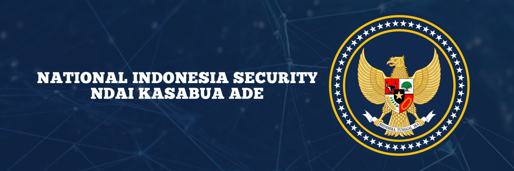

 <h1>Welcome to Github "NaInSec"</h1>

<h5>Penjahat akan tetap selalu menjadi penjahat, jika pahlawan menceritakan kisahnya. Setiap penjahat adalah pahlawan dalam ceritanya sendiri. Entah anda akan mati sebagai pahlawan, atau hidup cukup lama untuk menjadi seorang penjahat. Saya lebih memilih menjadi penjahat sesungguhnya daripada pahlawan palsu. Jika anda pikir ini memiliki akhir cerita yang bahagia, maka anda belum memperhatikan dengan baik. Jika anda tidak bisa menjadi pahlawan maka jadilah penjahat sejati. Dan jangan pernah untuk meminta maaf karena anda menjadi orang paling cerdas di dalam ruangan itu. Ingat! Sejarahlah yang akan menentukan apakah saya penjahat atau pahlawan. Entah bagaimana saya masih hidup di balik topeng ini, sedangkan saya tidak lebih dari sekedar daging busuk yang hidup karena nyawa. Dan di balik topeng ini ada sebuah ide yang sangat anti peluru.</h5>

